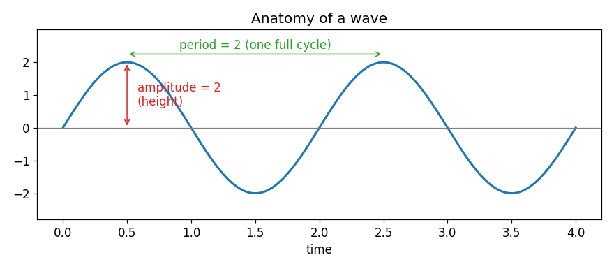
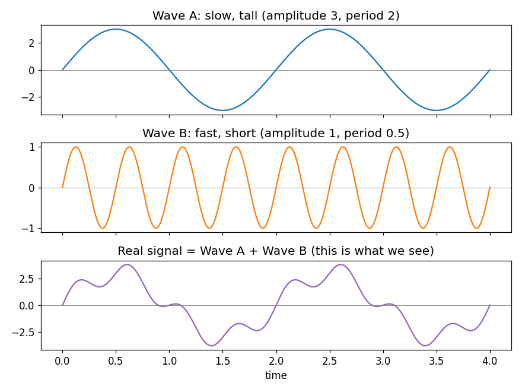
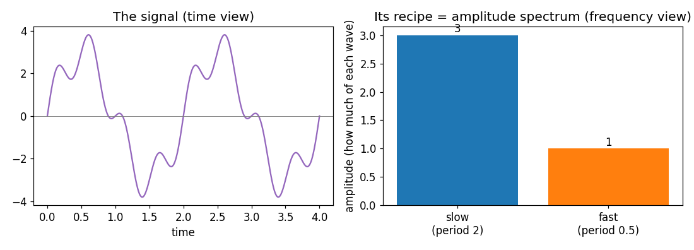
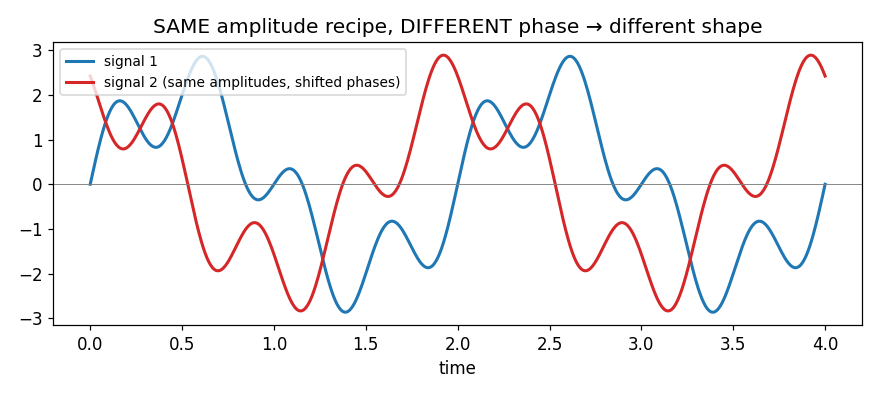
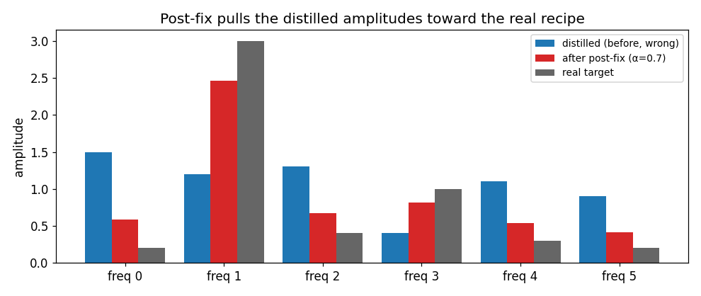
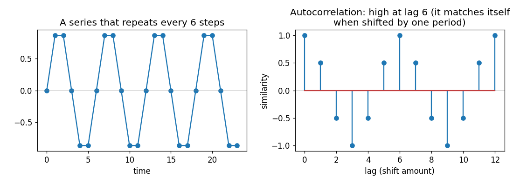

# Everything About the Post-Fix Method — Explained From Zero

*A teach-me-everything guide. No prior knowledge assumed. Every idea is built up
from simple pictures and tiny hand calculations you can check with a calculator.
By the end you will be able to explain the whole thing to anyone.*

---

## Part 0 — The one-sentence summary (read this first)

> Distillation squeezes a big dataset into a tiny fake one that still trains models well,
> but the tiny fake one **stops looking like a real time series**. We invented a cheap
> repair step that runs *after* distillation and makes the fake data look real again —
> and we measured exactly how well it works.

Everything below explains what each of those words means, slowly.

---

## Part 1 — What is a time series?

A **time series** is just a list of numbers measured over time, in order.

Examples:
- Temperature of an engine, measured every hour: `20, 21, 23, 22, 20, 19, …`
- Electricity used in a house, every 15 minutes.
- A currency exchange rate, every day.

Two important words:
- **Channel** = one measured quantity. An engine sensor might record 7 things at once
  (temperature, pressure, load, …). That is **7 channels**. Each channel is its own list
  of numbers.
- **Window** = a short slice of the series, e.g. "the last 96 readings". Models are trained
  on windows: *"given these 96 past values, predict the next 96."*

That is the entire raw material. Just ordered numbers.

---

## Part 2 — What is dataset distillation, and what is our problem?

Training modern models needs **huge** datasets. Storing and sharing them is expensive.

**Dataset distillation** is a clever trick: instead of keeping millions of real rows,
create a **tiny synthetic (fake) dataset** — say 384 rows — such that a model trained on
those 384 fake rows performs *almost as well* as a model trained on the millions of real
rows. It is like boiling a big pot of soup down to a tiny, super-concentrated cube.

The popular method to make that cube is called **MTT** (explained in Part 9). It works —
the model still learns.

**But here is the problem our research found:**

> The 384 fake rows train models well, but they **no longer look like a real time series**.
> The repeating daily patterns, the smooth rhythms, the seasonality — all gone. The fake
> data becomes a kind of useful noise.

Why does that matter? Because often we want the fake dataset to be **shareable and
inspectable** — a doctor, an engineer, or another researcher should be able to look at it
and trust it, or reuse it for a *different* task. Useful-but-ugly noise fails at that.

**Our contribution:** measure exactly *how* ugly it becomes, then **repair it** with a
cheap step that runs after distillation. To understand the repair, you need to understand
**waves**. That is Parts 3–6.

---

## Part 3 — Waves: amplitude, period, phase

Everything in our method is built on one idea: **any wiggly line can be described as a
mixture of simple waves.** So first, what is a single wave?

A wave (a sine wave) is the smoothest possible up-and-down wiggle. It has three properties:

1. **Amplitude** = how *tall* the wave is (how far up and down it goes). In the picture,
   amplitude = 2.
2. **Period** = how *long* one full up-down-back cycle takes. In the picture, period = 2.
   (A related word is **frequency** = how many cycles fit in a fixed time. Short period =
   high frequency = fast wiggle. Long period = low frequency = slow wiggle. They are two
   ways of saying the same thing.)
3. **Phase** = *where the wave starts* — is it going up at time zero, or already at the top,
   or coming down? Phase shifts the whole wave left or right without changing its height or
   speed.

Keep these three words. Amplitude = height. Period/frequency = speed of wiggle. Phase =
horizontal position. That's it.

---

## Part 4 — The big idea: any signal is a sum of waves

Here is the magic fact the whole field of signal processing is built on:

> **Any time series, no matter how complicated, can be built by adding together simple
> waves of different amplitudes, periods, and phases.**

Look:

- **Wave A** is slow and tall (a big, lazy rhythm — think "day vs night" temperature).
- **Wave B** is fast and short (a quick jitter on top).
- **Add them together** and you get the purple signal at the bottom — which looks
  complicated, but is secretly *just A + B*.

Real data is the same, only with *many* waves added instead of two. A real daily
temperature series is a slow 24-hour wave, plus a weekly wave, plus small fast wiggles,
all stacked up.

---

## Part 5 — The Fourier Transform: reading the recipe of a signal

If a signal is a sum of waves, a natural question is: **which waves, and how much of
each?** The tool that answers this is the **Fourier Transform** (FT).

Do not be scared of the name. Here is all it does:

> The Fourier Transform takes a wiggly signal and tells you its **recipe** — the list of
> waves inside it and how much of each one there is.

It's like a machine that tastes a smoothie and tells you "3 parts banana, 1 part
strawberry."

- **Left:** the signal in the normal "time view" — value going up and down as time passes.
- **Right:** the *same signal* in the "frequency view" — a bar chart showing the recipe.
  The tall blue bar says "there is a lot (amount 3) of the slow wave." The short orange bar
  says "there is a little (amount 1) of the fast wave."

That bar chart of "how much of each wave" is called the **amplitude spectrum**. It is the
single most important object in our whole method.

**Two views, same signal:**
- **Time view** = value vs time (the wiggly line).
- **Frequency view** = amplitude vs frequency (the recipe bar chart).

The Fourier Transform (FT) converts time view → frequency view.
The **inverse** Fourier Transform (written $\mathcal{F}^{-1}$) converts back: frequency
view → time view. It rebuilds the wiggly line from the recipe. This round trip is exact —
nothing is lost.

> **Jargon decoder:** `FFT` = "Fast Fourier Transform", just a fast computer algorithm for
> doing the FT. When you see `FFT` in our code, read it as "get the recipe of this signal."

---

## Part 6 — Amplitude vs Phase (the key to why our trick works)

The recipe actually has **two** parts for each wave, not one:

- **Amplitude** = *how much* of that wave (the bar height in Part 5). This carries the
  **seasonal energy** — how strong the daily rhythm is, how strong the weekly rhythm is.
- **Phase** = *where* each wave sits horizontally. This carries the exact **shape/timing**.

Why do we care about the difference? Because of this crucial picture:

Both the blue and red signals contain **exactly the same amount of each wave** (identical
amplitude recipe). The only difference is **phase** (the waves are shifted). Yet the two
signals *look different*.

The lesson:
- **Amplitude decides what rhythms are present and how strong** — the *character* of the
  data ("this is a strongly-daily signal").
- **Phase decides the exact wiggle positions** — the fine detail.

Our repair method will **fix the amplitude** (restore the correct rhythms) and **keep the
synthetic phase** (leave the fine detail alone). The next part shows exactly how.

---

## Part 7 — Our repair: FFT Amplitude Post-Fix, step by step

Now we can state the whole method. Remember the situation: distillation gave us 384 fake
rows whose **amplitude recipe is wrong** (the daily rhythm got weakened or scrambled). We
want to fix the recipe using the *real* data's recipe as a guide.

### Step 1 — Get the real recipe (a stable target)

The real training data is huge (say 8640 rows). The fake data is only 384. You cannot
directly compare recipes of different lengths, so we do this:

1. Chop the real series into back-to-back chunks of 384 rows each (that gives ~22 chunks).
2. Get the recipe (amplitude spectrum) of each chunk.
3. **Average** all 22 recipes.

Averaging many chunks smooths out random noise and gives one clean, stable "**this is what
a real 384-length window's recipe looks like**" target. We call it $\bar{A}$ ("A-bar", the
average amplitude).

> In the report this is **Equation 5.3**:
> $$\bar{A}_c = \frac{1}{K}\sum_{j=1}^{K} \big|\mathcal{F}(R_c^{(j)})\big|$$
> Plain English: "$\bar A_c$ for channel $c$ = the average, over all $K$ real chunks, of
> each chunk's amplitude recipe." $R_c^{(j)}$ is the $j$-th chunk of real channel $c$.

### Step 2 — Split the fake signal into amplitude + phase

Take the fake channel, get its recipe. Keep two things: its **amplitude** (probably wrong)
and its **phase** (we will keep this untouched).

> **Equation 5.2:** $\mathcal{F}(S_c) = |\mathcal{F}(S_c)|\,e^{i\phi_c}$.
> Scary symbols, simple meaning: "the fake signal's recipe = its amplitude
> $|\mathcal{F}(S_c)|$ combined with its phase $\phi_c$." The $e^{i\phi}$ part is just the
> mathematical way to carry a phase angle. You can read it as "…with phase $\phi$".

### Step 3 — Blend the amplitudes (this is the whole trick)

Now mix the fake amplitude with the real target amplitude, using a knob **α** (alpha)
between 0 and 1:

$$\text{new amplitude} = (1-\alpha)\times(\text{fake amplitude}) + \alpha\times(\text{real amplitude }\bar A)$$

- **α = 0** → new = 100% fake amplitude → nothing changes.
- **α = 1** → new = 100% real amplitude → the fake data now has the *exact real rhythms*.
- **α = 0.5** → halfway between.

α is a single dial for "how much real rhythm to inject."

### Step 4 — Rebuild the signal (keep the fake phase)

Combine the **new blended amplitude** with the **old fake phase**, then run the inverse
Fourier Transform ($\mathcal{F}^{-1}$) to turn the recipe back into a normal wiggly time
series.

> **Equation 5.4** (the full method in one line):
> $$\tilde{S}_c = \mathcal{F}^{-1}\!\Big[\big((1-\alpha)\,|\mathcal{F}(S_c)| + \alpha\,\bar A_c\big)\,e^{i\phi_c}\Big]$$
> Reading it left to right: "the fixed signal $\tilde S_c$ = inverse-transform of
> ( blended amplitude ) with ( kept fake phase )." That is literally Steps 2–4.

Here is the blend happening on a picture (α = 0.7):

- **Blue** = the distilled (fake) amplitudes — all wrong, roughly flat, no clear rhythm.
- **Black** = the real target recipe — notice the big spike at "freq 1" (a strong rhythm).
- **Red** = after post-fix — the blue bars got pulled 70% of the way toward black. The
  strong rhythm at freq 1 is now mostly restored.

### A tiny hand calculation of the blend

Suppose one frequency has fake amplitude **1.5** and real amplitude **3.0**, and we pick
**α = 0.7**:

$$\text{new} = (1-0.7)\times 1.5 + 0.7\times 3.0 = 0.3\times1.5 + 0.7\times3.0 = 0.45 + 2.10 = 2.55$$

So that frequency's amplitude moves from 1.5 up to 2.55 — 70% of the way toward the real
value 3.0. Do this for every frequency and you have fixed the recipe. That's the whole
method. It is just a weighted average, done in the recipe world.

---

## Part 8 — The α knob and one beautiful fact

Because the blend is a simple weighted average, the "distance" between the fixed recipe and
the real recipe shrinks in a perfectly straight line as α grows:

> **Equation 5.5:** $d_{\text{FFT}}(\tilde S) = (1-\alpha)\,d_{\text{FFT}}(S)$
> Meaning: "the recipe error after fixing = (1−α) × the recipe error before fixing."

Check with numbers: if the error before was 0.36 and α = 0.5, error after = (1−0.5)×0.36 =
0.18 (exactly half). At α = 1, error = 0×0.36 = **0** — a perfect recipe match. Our
experiments confirmed this hits essentially zero every single time.

This is why α is such a nice control: it is a direct, predictable dial on "how much of the
real temporal structure to restore."

---

## Part 9 — MTT: how the fake data was made in the first place

You do not need this to understand the repair, but it explains *why the recipe got broken*.

**MTT (Matching Training Trajectories)** makes the fake data like this:
1. Train a real model on real data and take snapshots of its internal settings ("weights")
   as it learns — like photographing a student's notebook at each stage of studying.
2. Then adjust the fake data so that a fresh model, trained briefly on the fake data,
   reaches the *same weights* as the real model did.

In short: **the fake data is tuned so it pushes a model's weights the same way real data
would.**

> **Equation 5.1** (the MTT score it minimizes):
> $$\mathcal{L}_{\text{MTT}}(S) = \frac{\lVert \theta_{\text{student}} - \theta_{\text{expert-target}} \rVert^2}{\lVert \theta_{\text{expert-start}} - \theta_{\text{expert-target}} \rVert^2 + \varepsilon}$$
> $\theta$ (theta) means "the model's weights". The top is "how far the student ended from
> the target". The bottom is "how far the target was to begin with" (used to keep the score
> on a fair scale). Small score = student landed where the real model landed = good fake
> data. The $\varepsilon$ is a tiny number so we never divide by zero.

**Why this breaks the recipe:** the score *only* cares about where the model's weights end
up. It never looks at the fake data as a time series. So two totally different-looking fake
datasets are equally good to MTT as long as they nudge the weights the same way. With no
reason to keep the daily rhythm, MTT throws it away. **That is the exact hole our post-fix
fills.**

---

## Part 10 — The measuring tape: our temporal-fidelity metrics

To prove the fake data got "ugly" and then "fixed", we need numbers that score how close
the fake series is to the real one. We use eight. **For all of them, lower = closer to
real = better.** Here is each one in plain words with a tiny hand calculation **and a full
breakdown of its equation, symbol by symbol.**

### 10.0 First — how to read the math symbols (a dictionary)

Every equation below is built from the same small set of symbols. Learn these once and the
formulas stop being scary. Read this table slowly; refer back to it as needed.

**Symbols for the data:**

| Symbol | Say it as | Means |
|---|---|---|
| $S$ | "S" | the whole **synthetic** (fake) series |
| $R$ | "R" | the whole **real** series |
| $S_c$, $R_c$ | "S sub c" | **channel number $c$** — one column of the data |
| $C$ | "C" | the **total number of channels** (7 for ETT, 21 for weather) |
| $M$ | "M" | the **length** of the synthetic series (384) |
| $N$ | "N" | the **length** of the real series (e.g. 8640) |
| $x_t$ | "x sub t" | the value **at time step $t$** |
| $\bar{x}$ | "x-bar" | the **average** of all the $x$ values |
| $\bar{A}_c$ | "A-bar sub c" | the **average real amplitude recipe** for channel $c$ (from Part 7) |

**Symbols for operations:**

| Symbol | Say it as | Means |
|---|---|---|
| $\mathcal{F}(\cdot)$ | "F of …" | **Fourier Transform** = "get the recipe" |
| $\lvert \mathcal{F}(S_c)\rvert$ | "size of F of S" | the **amplitude** of the recipe (bar heights) |
| $\lvert -3 \rvert$ | "absolute value" | drop the minus sign: $\lvert-3\rvert = 3$ |
| $\lVert \cdot \rVert_2$ | "norm" / "length" | **length of a list of numbers**: square each, add, square-root. $\lVert[3,4]\rVert_2=\sqrt{9+16}=5$ |
| $\lVert \cdot \rVert_F$ | "Frobenius norm" | the **same length idea but for a grid/table** of numbers |
| $\sum_{c=1}^{C}$ | "sum from c=1 to C" | **add it up** for every channel: $z_1+z_2+\dots+z_C$ |
| $\frac{1}{C}\sum$ | — | **average** (add up, then divide by the count) |
| $\arg\max$ | "arg-max" | the **position** of the biggest value (NOT the value — its *location*) |
| $[f^*]$ | "at slot f-star" | **indexing** — "the value at position $f^*$", like `list[3]` |

> ⚠️ **Two traps to avoid:**
> 1. **Vertical bars mean two different things.** Around a plain number, $\lvert\cdot\rvert$
>    = absolute value. Around a recipe, $\lvert\mathcal F(S_c)\rvert$ = amplitude. Context
>    tells you which.
> 2. **Capital $\Sigma$ means two different things.** With little numbers above/below
>    ($\sum_{c=1}^C$) it means "add up". Standing alone ($\Sigma_S$, in the last metric) it
>    is a **correlation matrix** (a grid). Same letter, totally different job.

**Greek letters you will meet:**

| Letter | Say it as | Means |
|---|---|---|
| $\rho$ | "rho" | an **autocorrelation** value (how much a series matches a shifted copy of itself) |
| $\ell$ | "ell" | a **lag** = a shift amount. $L$ = the biggest lag we check |
| $\tau$ | "tau" | the **trend** component (the slow drift) |
| $\sigma^2$ | "sigma squared" | the **variance** (how spread out the numbers are) |
| $\Sigma_S,\ \Sigma_R$ | "capital sigma" | a **correlation matrix** (grid of channel relationships) |
| $\alpha$ | "alpha" | the **blend dial** (0 to 1) from Part 7 |
| $\phi$ | "phi" | the **phase** (horizontal position of a wave) |

Now each metric below shows: **(a)** its real formula, **(b)** a table decoding every
symbol in it, and **(c)** how to read the whole thing as one plain English sentence.

### 10.1 `fft_distance` — is the whole recipe right?

Compares the fake amplitude recipe against the real recipe, frequency by frequency.

**Hand example.** Say there are 3 frequencies.
Real recipe = `[3, 1, 0.5]`, fake recipe = `[2, 1, 1.5]`.
Differences = `3−2=1`, `1−1=0`, `0.5−1.5=−1`.
Combine them (square, add, square-root — the "length" of the difference list):
$$\sqrt{1^2 + 0^2 + (-1)^2} = \sqrt{2} \approx 1.41$$
Then divide by the length to keep it comparable across datasets. Big number = recipe very
wrong. After post-fix at α=1 this goes to 0.

**The equation, dissected (Eq 5.6):**

$$d_{\text{FFT}}(S) \;=\; \frac{1}{C}\sum_{c=1}^{C}\;\frac{1}{M}\;\Big\lVert\; \lvert\mathcal{F}(S_c)\rvert \;-\; \bar{A}_c \;\Big\rVert_2$$

| Piece | What it means |
|---|---|
| $d_{\text{FFT}}(S)$ | the final score for the synthetic series $S$ |
| $\lvert\mathcal{F}(S_c)\rvert$ | the fake channel's **amplitude recipe** — a list of bar heights |
| $\bar{A}_c$ | the **real** average recipe — a same-length list of bar heights |
| $\lvert\mathcal{F}(S_c)\rvert - \bar{A}_c$ | subtract the two recipes → a **list of differences**, one per frequency |
| $\lVert\;\cdots\;\rVert_2$ | the **length** of that difference list (square, add, root) |
| $\frac{1}{M}$ | divide by length so datasets are comparable |
| $\frac{1}{C}\sum_{c=1}^{C}$ | do all of the above **for each channel and average** |

**Read it as a sentence:** *"For each channel, subtract the fake recipe from the real
recipe, measure the length of what's left over, scale it, and average across all channels."*

*(Report note: the code averages over channels, so the written formula needs the $\frac1C$
shown here — a small fix we flagged.)*

### 10.2 `freq_rank_error` — is the *main* rhythm right?

Every series has one **dominant** rhythm — the tallest bar in the recipe. This metric asks:
*does the fake data's tallest bar sit at the same frequency as the real data's tallest bar?*

**Hand example.** Real data's tallest bar is at frequency slot **5** (say, a daily rhythm).
Fake data's tallest bar is at slot **18** (some random fast jitter). Error = `|5 − 18| =
13`. That means the fake data does not even peak at the right rhythm — it thinks the wrong
wave is dominant. (This actually happened: raw distilled ETTh2 had an error of ~13.) After
post-fix at α=1 it becomes 0 — the correct rhythm is dominant again.

**The equation, dissected (Eq 5.7):**

$$e_{\text{rank}} \;=\; \frac{1}{C}\sum_{c=1}^{C}\;\Big\lvert\; \arg\max_{f>0}\lvert\mathcal{F}(S_c)\rvert \;-\; \arg\max_{f>0}\bar{A}_c \;\Big\rvert$$

| Piece | What it means |
|---|---|
| $\arg\max_{f>0}\lvert\mathcal{F}(S_c)\rvert$ | the **frequency slot where the fake recipe is tallest** (its dominant rhythm) |
| $\arg\max_{f>0}\bar{A}_c$ | the frequency slot where the **real** recipe is tallest |
| $f>0$ | "skip slot 0" — slot 0 is the flat average level, not a rhythm, so we ignore it |
| $\big\lvert \cdots - \cdots \big\rvert$ | absolute value → **how many slots apart** the two peaks are (always positive) |
| $\frac{1}{C}\sum_{c=1}^{C}$ | do it per channel and **average** |

**Read it as a sentence:** *"Find which frequency is the tallest bar in the fake recipe and
in the real recipe; the gap between those two positions is the error; average over
channels."* An error of 0 means both peak at the same rhythm.

### 10.3 `peak_mag_ratio` — is the main rhythm *strong* enough?

Even if the main rhythm is in the right place, is it tall enough? This measures the missing
fraction of energy at that dominant rhythm.

**Hand example.** Real dominant amplitude = **3.0**. Fake amplitude at that same frequency
= **1.5**. Missing fraction:
$$\frac{|3.0 - 1.5|}{3.0} = \frac{1.5}{3.0} = 0.5$$
0.5 means **half** the daily-rhythm energy is missing. (Typical raw distilled value ≈ 0.45,
i.e. ~45% missing.) After post-fix at α=1 → 0 (all energy restored).

**The equation, dissected (Eq 5.8):**

$$r_{\text{peak}} \;=\; \frac{1}{C}\sum_{c=1}^{C}\; \frac{\big\lvert\, \bar{A}_c[f^*] \;-\; \lvert\mathcal{F}(S_c)\rvert[f^*] \,\big\rvert}{\bar{A}_c[f^*]}, \qquad f^* = \arg\max_{f>0}\bar{A}_c$$

| Piece | What it means |
|---|---|
| $f^*$ | the **real dominant frequency** — the slot where the real recipe peaks |
| $\bar{A}_c[f^*]$ | the **real** amplitude **at that slot** (one single number) |
| $\lvert\mathcal{F}(S_c)\rvert[f^*]$ | the **fake** amplitude at that **same** slot (one number) |
| $\big\lvert\,\cdots - \cdots\,\big\rvert$ | absolute difference → **how much energy is missing** there |
| $\div\ \bar{A}_c[f^*]$ | divide by the real energy → express it as a **fraction** (0 = none missing, 1 = all missing) |
| $\frac{1}{C}\sum_{c=1}^{C}$ | per channel, then **average** |

**Read it as a sentence:** *"At the exact frequency where the real data is strongest, what
fraction of that strength is missing in the fake data? Average over channels."* Note this
looks at the **real** peak location $f^*$ — even if the fake peak is elsewhere, we ask "how
much did you put at the place that actually matters."

### 10.4 `acf_short` & `acf_long` — does the past predict the future correctly?

**Autocorrelation** answers: "if I shift the series by *k* steps and lay it on top of
itself, how well does it match?" A seasonal series matches itself well when shifted by
exactly one season.

- **Left:** a series that repeats every 6 steps.
- **Right:** its autocorrelation. It is high at **lag 6** — because shifting by 6 lands one
  full period later, so it lines up with itself. "Lag" just means "shift amount".

**Hand example.** Compare autocorrelation at lags 1, 2, 3.
Real = `[0.9, 0.7, 0.5]`, fake = `[0.6, 0.5, 0.5]`.
Differences = `0.3, 0.2, 0.0`. Average = `(0.3+0.2+0.0)/3 = 0.167`. That's the ACF error.

We split it in two:
- **`acf_short`** = error at *short* shifts (up to one season) → captures the fast/seasonal
  dependence.
- **`acf_long`** = error at *long* shifts → captures slow, long-range memory.

Nice bonus: fixing the amplitude recipe **automatically** improves autocorrelation, because
of a math law (Wiener–Khinchin) that says "the recipe and the autocorrelation are two views
of the same information." So we get ACF improvement for free.

**The equation, dissected (Eq 5.9).** Two formulas: the score, and the autocorrelation it uses.

*The score* — compare fake vs real autocorrelation at each lag and average:

$$e_{\text{acf}} \;=\; \frac{1}{L}\sum_{\ell=1}^{L}\big\lvert\, \rho_S(\ell) \;-\; \rho_R(\ell) \,\big\rvert$$

| Piece | What it means |
|---|---|
| $\ell$ | the **lag** = shift amount (1 step, 2 steps, …) |
| $L$ | the biggest lag checked; $\frac{1}{L}\sum_{\ell=1}^L$ = **average over all lags** |
| $\rho_S(\ell)$ | the **fake** series' autocorrelation at lag $\ell$ |
| $\rho_R(\ell)$ | the **real** series' autocorrelation at lag $\ell$ |
| $\lvert\,\cdots\,\rvert$ | absolute difference at that lag |

*The autocorrelation itself* — how much a series matches a copy of itself shifted by $\ell$:

$$\rho_X(\ell) \;=\; \frac{\sum_t (x_t - \bar{x})(x_{t+\ell} - \bar{x})}{\sum_t (x_t - \bar{x})^2}$$

| Piece | What it means |
|---|---|
| $x_t - \bar{x}$ | how far each value sits **above/below the average** |
| $x_{t+\ell} - \bar{x}$ | the same, but for the value **$\ell$ steps later** |
| $(x_t-\bar x)(x_{t+\ell}-\bar x)$ | multiply them: **positive if both are high together or low together** (they move in sync) |
| $\sum_t$ | add that up over all time steps $t$ |
| $\div\ \sum_t (x_t-\bar x)^2$ | divide by the series' own spread → forces the answer into the range **−1 to +1** |

**Read it as a sentence:** *"Autocorrelation at lag $\ell$ = how strongly the series lines
up with itself when shifted by $\ell$ steps (1 = perfect match, 0 = no relation). Compute it
for the fake and real series at every shift, and average how different they are."* We split
the average into **short** lags (`acf_short`, seasonal) and **long** lags (`acf_long`,
long-memory).

### 10.5 `trend_error` — is the slow drift right?

The **trend** is the slow, smooth drift of a series ignoring the wiggles — like the general
"getting warmer over the month" underneath daily ups and downs. This metric compares the
fake trend to the real trend.

**Hand example.** Real trend line = `[10, 11, 12]`, fake trend line = `[10, 10, 10]`
(fake missed the upward drift). Differences = `0, 1, 2`. Combine (length of difference
list) and scale by sequence length. Bigger = trend more wrong.

Important honesty: our amplitude fix **cannot** repair trend well, because trend lives in
the very slowest wave (near "zero frequency"), which the amplitude blend barely touches.
This is a stated limitation.

**The equation, dissected (Eq 5.10, first part):**

$$e_{\text{trend}} \;=\; \frac{1}{\sqrt{N}}\,\big\lVert\, \tau(S) \;-\; \tau(R) \,\big\rVert_2$$

| Piece | What it means |
|---|---|
| $\tau(S)$ | the **slow trend line** pulled out of the fake series (a list of numbers over time) |
| $\tau(R)$ | the slow trend line pulled out of the **real** series |
| $\tau(S) - \tau(R)$ | subtract → a list of differences, one per time step |
| $\lVert\,\cdots\,\rVert_2$ | the **length** of that difference list |
| $\frac{1}{\sqrt{N}}$ | divide by $\sqrt{N}$ so it's an **average-size error per step**, not a total |

**Read it as a sentence:** *"Pull the slow drift out of each series (ignoring the wiggles),
then measure how far apart the two drift-lines are."* The trend $\tau$ is obtained by a
standard smoothing procedure (STL) that separates slow drift from fast wiggle.

*(Report note: the code includes the $\frac{1}{\sqrt N}$ shown here — flag it for the
written formula.)*

### 10.6 `variance_diff` — is the data as *spread out* as real?

**Variance** measures how spread out numbers are. `[5,5,5]` has zero variance (no spread).
`[0,5,10]` has large variance.

**Hand example.** Real variance = **4.0**, fake variance = **3.0**. Relative difference:
$$\frac{|4.0 - 3.0|}{4.0} = \frac{1.0}{4.0} = 0.25$$
So the fake data is 25% off in spread. Another honest limitation: the amplitude blend does
not reliably fix variance either (a law called Parseval ties variance to the *total* recipe
energy, which a partial blend mostly preserves).

**The equation, dissected (Eq 5.10, second part):**

$$e_{\text{var}} \;=\; \frac{\big\lvert\, \sigma_S^2 \;-\; \sigma_R^2 \,\big\rvert}{\sigma_R^2}$$

| Piece | What it means |
|---|---|
| $\sigma_S^2$ | the **variance** (spread) of the fake data |
| $\sigma_R^2$ | the **variance** of the real data |
| $\big\lvert\, \sigma_S^2 - \sigma_R^2 \,\big\rvert$ | absolute difference in spread |
| $\div\ \sigma_R^2$ | divide by the real spread → a **fraction** (0.25 = 25% off) |

**Read it as a sentence:** *"How far off is the fake data's spread, measured as a fraction of
the real spread?"* Variance is just "how spread out the numbers are": `[5,5,5]` has spread 0,
`[0,5,10]` has large spread.

### 10.7 `cross_corr_error` — do the channels relate correctly?

With multiple channels, real channels often move together (e.g. engine temperature rises
when load rises). This checks whether the fake data keeps those *between-channel*
relationships.

**Hand example.** For channels A and B, real correlation = **0.8** (they rise together).
Fake correlation = **0.3** (relationship weakened). The error collects all such differences
across every channel pair into one number. Bigger = relationships more broken.

**The equation, dissected (Eq 5.11):**

$$e_{\text{xcorr}} \;=\; \frac{1}{C}\,\big\lVert\, \Sigma_S \;-\; \Sigma_R \,\big\rVert_F, \qquad \Sigma_X = \operatorname{corr}(X)$$

| Piece | What it means |
|---|---|
| $\Sigma_S$ | the fake data's **correlation matrix** — a grid where entry $(i,j)$ = how strongly channel $i$ moves with channel $j$ |
| $\Sigma_R$ | the **real** data's correlation grid |
| $\Sigma_S - \Sigma_R$ | subtract the two grids → a **grid of differences** |
| $\lVert\,\cdots\,\rVert_F$ | the **Frobenius norm** — the "length" of a whole grid (square every entry, add, square-root) |
| $\frac{1}{C}$ | divide by the number of channels so datasets with more channels compare fairly |

> ⚠️ Here $\Sigma$ is a **matrix**, not a sum — there are no little numbers above/below it.

**Read it as a sentence:** *"Build the channel-relationship grid for the fake data and for
the real data, then measure how different the two grids are."* A correlation of +1 = two
channels rise and fall together; 0 = unrelated; −1 = one rises when the other falls.

*(Report note: the code divides by $C$ shown here — flag it for the written formula.)*

### Summary table of the eight metrics

| Metric | Plain question it answers | Fixed by post-fix? |
|---|---|---|
| `fft_distance` | Is the whole recipe right? | ✅ → 0 at α=1 |
| `freq_rank_error` | Is the main rhythm in the right place? | ✅ → 0 at α=1 |
| `peak_mag_ratio` | Is the main rhythm strong enough? | ✅ → 0 at α=1 |
| `acf_short` | Right short-range repetition? | ✅ improves (free) |
| `acf_long` | Right long-range memory? | ✅ improves (free) |
| `trend_error` | Right slow drift? | ❌ not really (limitation) |
| `variance_diff` | Right spread? | ❌ not really (limitation) |
| `cross_corr_error` | Right channel relationships? | ➖ sometimes |

---

## Part 11 — What our results actually showed (in plain words)

We ran everything on **5 datasets × 3 models × 3 random seeds × 7 values of α = 315 runs.**

**Finding 1 — Distillation really does break the recipe.**
At α = 0 (raw distilled data) the recipe was wrong on every dataset — up to half the daily
rhythm missing, and on one dataset the fake data peaked at completely the wrong rhythm.

**Finding 2 — The post-fix reliably repairs it.**
At α = 1, the three recipe metrics (`fft_distance`, `freq_rank_error`, `peak_mag_ratio`)
went to **zero in all 315 runs**, and autocorrelation improved for free. This is the strong,
headline result.

**Finding 3 — Effect on model performance depends on the dataset.**
For fast-sampled, strongly-seasonal data (15-minute ETTm, 10-minute weather), fixing the
rhythm often **also made the model better** (because the rhythm *is* the useful signal —
e.g. one case improved 44%). For slower hourly data with weak seasonality, it cost a little
model accuracy. So α is a dial you tune per dataset.

**Finding 4 — Honest limits.**
It fixes *frequency-domain* things (rhythms, spectrum, autocorrelation) but **not** trend or
variance. That is expected from the math, and it points to the next research step: a
combined fix that also repairs trend and spread.

---

## Part 12 — The 60-second version you can say out loud

> "A time series is a sum of simple waves. The Fourier Transform reads off the *recipe* —
> how much of each wave. Distillation makes a tiny fake dataset that trains models well but
> scrambles that recipe, so the fake data stops looking like real data. Our fix runs after
> distillation: it takes the *real* data's average recipe and blends the fake data's
> amplitudes toward it, controlled by one dial α, while keeping the fake data's fine detail
> (its phase). At full strength the recipe becomes a perfect match. Across 315 experiments
> it restored the rhythms every time, sometimes even improving the model, and its only real
> limits are slow trend and overall spread — which is our next piece of work."

That's the whole thing. You now understand every symbol in the report.
